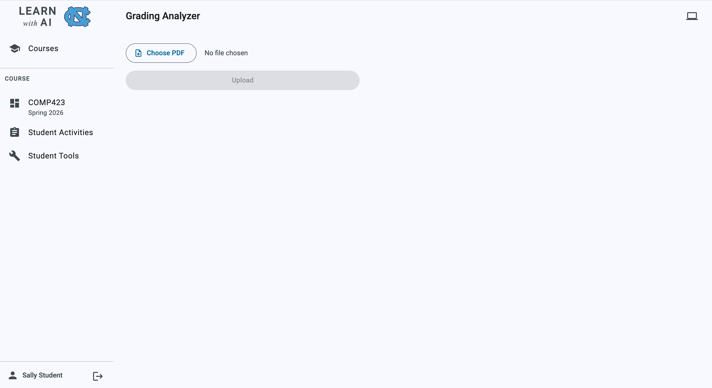
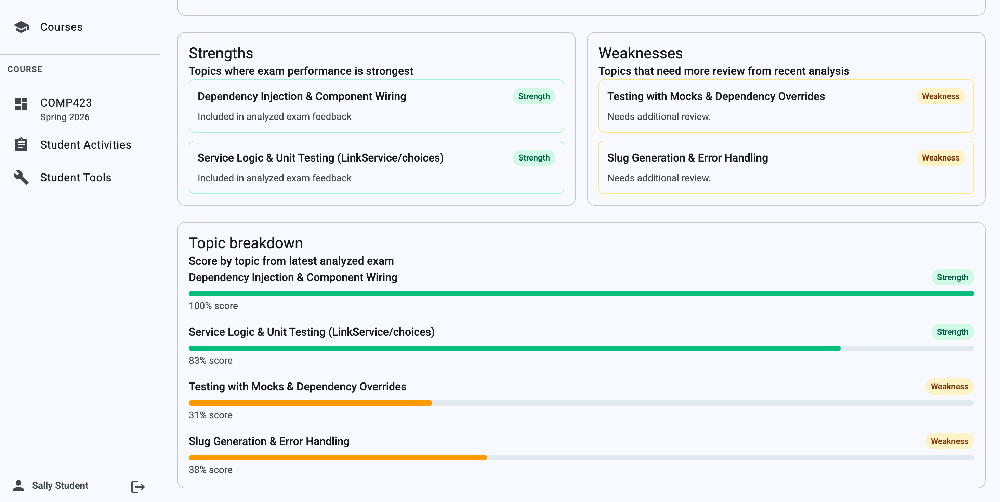
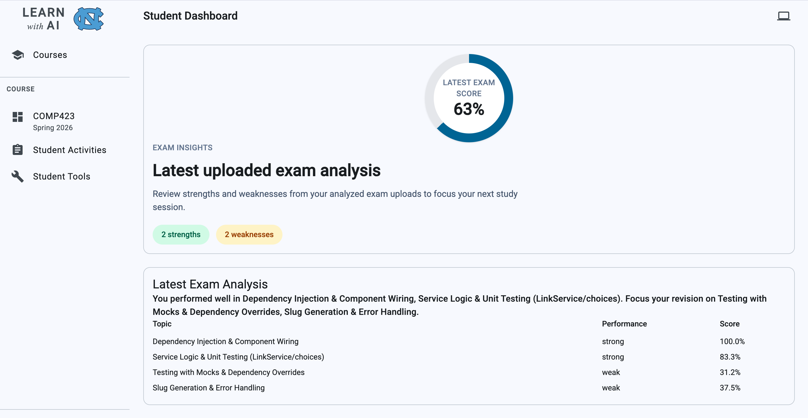
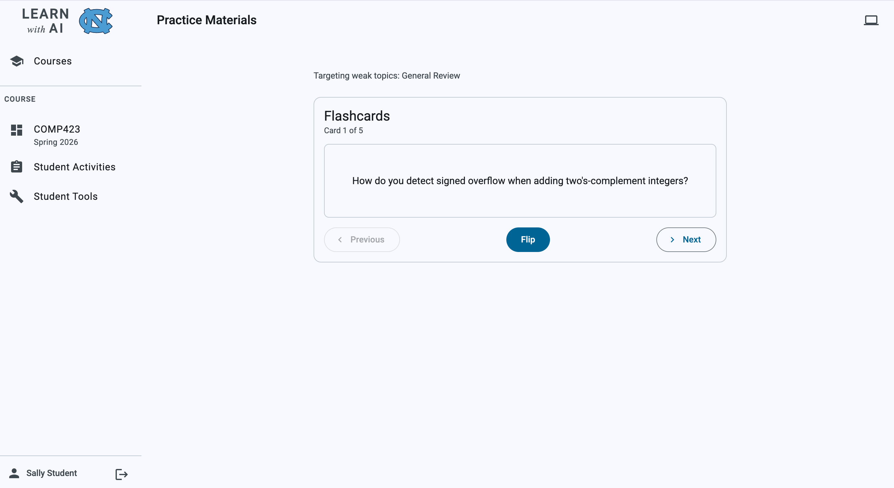

# LearnWithAI — Feature Implementation Guide

This document explains how the two features implemented in Sprints 1 and 2 work across every layer of the stack. It is written for a developer who wants to understand or extend this work.

## Authors

| Name           | GitHub                                             |
| -------------- | -------------------------------------------------- |
| Bettina George | [@BettinaGeorge](https://github.com/BettinaGeorge) |
| Celine Keles   | [@ceseke](https://github.com/ceseke)               |
| Ishi Varshney  | [@ishiv101](https://github.com/ishiv101)           |
| Tiffany Meng   | [@ttmeng](https://github.com/ttmeng)               |

---

## Feature Overview

The **Grading Analyzer** is a student-facing tool. A student uploads a graded exam PDF. The backend extracts text from the PDF and passes it to an AI model, which returns a structured breakdown of performance by topic. The student's dashboard shows an overall score, topic strengths, and areas to review. 

The **Practice Material Generator** takes the weak topics extracted from the Grading Analyzer and generates 5 flashcards with questions for the student to review.

---

## Repository Layout

```
frontend/                   Angular 19 single-page application
api/                        FastAPI adapter — HTTP routes only, no business logic
packages/
  learnwithai-core/         shared Python package — tables, repositories, services, jobs
  learnwithai-jobqueue/     Dramatiq + RabbitMQ adapter for background jobs
```

Both `api/` and the worker process import `learnwithai-core`. All business logic, database tables, and services belong there, not in `api/`.

---

## Frontend

### Routing

All feature routes are children of `/courses/:id` and are lazy-loaded:

```
/courses/:id/tools/grading-analyzer              → PDF upload (instructor path)
/courses/:id/tools/grading-analyzer/results      → analysis results
/courses/:id/student                             → student dashboard
/courses/:id/student/tools/grading-analyzer      → PDF upload (student path)
/courses/:id/student/tools/grading-analyzer/practice → flashcard practice
```

### Key Components


**`GradingAnalyzer`** validates a picked file client-side (PDF type and ≤ 50 MB) before uploading. After a successful upload it navigates to the results page with the `uploadId` as a query param. Both the instructor and student paths load this same component; the component checks its active route to decide where to send the user afterward.




**`StudentView`** is the student dashboard. When reached with an `uploadId` query param it polls the analysis endpoint every two seconds for up to 30 attempts while displaying a spinner. It also listens on the WebSocket for `exam_analysis` job completions so the dashboard refreshes automatically. The result is a progress ring for overall score and a topic list labeled as strengths, needs review, or weak.



### Frontend Services

**`GradingAnalyzerService`** handles PDF uploads, fetches analysis by upload ID, and exposes `getLatestAnalysis()` which finds the most recent upload that already has a completed analysis.

**`JobUpdateService`** keeps a single WebSocket connection per course, reference-counted with `subscribe()` / `unsubscribe()`. It exposes `updateForJob(jobId)` and `updatesForCourse(courseId)` as Angular signals that components react to via `effect()`.

---

## Backend — API Layer

All routes are mounted under `/api`. Route handlers stay thin — they validate the request, call a service, and return a response model.


### Exam PDF and Practice Routes

| Method | Path                                                  | Notes                                                                 |
| ------ | ----------------------------------------------------- | --------------------------------------------------------------------- |
| `POST` | `/courses/{course_id}/exam-pdfs`                      | Validates content type, extension, size, and PDF header. Returns 202. |
| `GET`  | `/courses/{course_id}/exam-pdfs`                      | Lists the authenticated student's uploads, newest first.              |
| `GET`  | `/courses/{course_id}/exam-pdfs/{upload_id}/analysis` | Returns `ExamAnalysisSummary`. Returns 404 if analysis is not ready.  |
| `POST` | `/courses/{course_id}/exam-pdfs/{upload_id}/practice` | Idempotent. Returns cached materials (200) or queues a new job (202). |
| `GET`  | `/courses/{course_id}/exam-pdfs/{upload_id}/practice` | Returns generated flashcards and topic list.                          |

### Key Request and Response Models


**Exam PDF / Practice:**

| Model                      | Key Fields                                                               |
| -------------------------- | ------------------------------------------------------------------------ |
| `ExamPdfUploadResponse`    | `id`, `storage_key`, `original_filename`, `job?`                         |
| `ExamPdfHistoryItem`       | `id`, `original_filename`, `uploaded_at`, `has_analysis`, `has_practice` |
| `ExamPdfAnalysisResponse`  | `upload_id`, `analysis_data` (`ExamAnalysisSummary`)                     |
| `PracticeMaterialResponse` | `upload_id`, `weak_topics`, `flashcards`                                 |

### Dependency Injection and Transactions

Routes declare dependencies as annotated type aliases defined in `api/src/api/di.py`. FastAPI resolves and injects these automatically. Route handlers must never call `session.commit()` or `session.rollback()`; the `get_session()` dependency commits after a successful response and rolls back on any exception.

---

## Backend — Core Package

All business logic lives in `packages/learnwithai-core/src/learnwithai/`.

### Exam Analysis and Practice Material Services

`ExamAnalysisService` (`services/exam_analysis_service.py`) sends the raw extracted PDF text to the AI model with a structured prompt asking for 3–5 topic categories, a mapping of every question to a topic, and performance labels (`strong`, `needs_review`, `weak`). If the model response cannot be parsed as valid JSON matching the expected schema, the service falls back to a keyword-extraction algorithm that derives topics from the most frequent words in the exam text.

`summarize_analysis()` converts the detailed internal analysis into the `ExamAnalysisSummary` the API returns, guaranteeing at least one strength and one weakness entry even if the model returns a uniform performance classification.

`PracticeMaterialService` (`services/practice_material_service.py`) reads the weak and needs-review topics from the completed analysis and the extracted exam text, then asks the AI for 5 flashcards per weak topic. The JSON response is validated and stored in the `practice_material` table. Calling the endpoint a second time returns the cached record immediately rather than re-generating.

### Background Job Handlers

`PracticeMaterialJobHandler` (`services/exam_analysis_job.py`) follows the same pattern using `PracticeMaterialService.generate_materials()`.

The base class `BaseJobHandler` manages the session lifecycle, the `PROCESSING` status transition, commit/rollback, and publishing a status update to RabbitMQ so the WebSocket layer can push it to the browser.

### AI Completion Service

`AiCompletionService` (`services/ai_completion_service.py`) wraps the OpenAI Python SDK configured for Azure. Its single public method, `complete(system_prompt, user_prompt)`, calls the chat completions endpoint and returns the model's response as a string. Every AI-backed feature routes through this wrapper.

| Environment Variable                       | Default                            | Purpose               |
| ------------------------------------------ | ---------------------------------- | --------------------- |
| `OPENAI_API_KEY` / `AZURE_OPENAI_API_KEY`  | —                                  | Azure API key         |
| `OPENAI_MODEL` / `AZURE_OPENAI_DEPLOYMENT` | `gpt-5-mini`                       | Model deployment name |
| `OPENAI_ENDPOINT`                          | `https://azureaiapi.cloud.unc.edu` | Azure endpoint        |
| `OPENAI_API_VERSION`                       | `2025-04-01-preview`               | API version           |

---

## Database

The database is PostgreSQL accessed through SQLModel. The feature adds the following tables on top of the existing scaffold:

```
async_job             unified job tracking for all background work

exam_pdf_upload       one row per uploaded PDF (stores analysis_data as JSON)
  ├── exam_pdf_text   1:1 — extracted text
  └── practice_material 1:1 — generated flashcards stored as JSON
```

Key design decisions worth noting:

- `exam_pdf_upload.analysis_data` stores the full `ExamPerformanceAnalysis` JSON directly on the upload row rather than in a separate table, which keeps the read path for the analysis endpoint to a single query.
- `async_job` is a single unified table for every job kind, discriminated by the `kind` column (`"iyow_feedback"`, `"exam_analysis"`, `"practice_material"`). The `input_data` and `output_data` columns carry job-type-specific JSON payloads.
- Only one submission per student per activity is active at a time. Resubmitting flips `is_active` to false on the previous row before creating a new one.

---

## AI Integration

The same pattern drives all three AI-backed operations. The route handler creates an `AsyncJob` record in `PENDING` status, enqueues the job payload, and returns HTTP 202 immediately. The Dramatiq worker picks up the job, calls `AiCompletionService.complete()`, writes the result to the database, and publishes a status notification. The browser receives the notification over WebSocket and updates the UI without a reload.

### Exam Analysis

```
Student uploads PDF → POST /courses/{id}/exam-pdfs
  ExamPdfService stores file, creates ExamPdfUpload + ExamPdfText + AsyncJob, enqueues job
  → 202 returned

Worker: ExamAnalysisJobHandler
  → calls ExamAnalysisService.analyze_from_text() with extracted text
  → AI returns topic/performance JSON (fallback to keyword extraction if invalid)
  → writes analysis to exam_pdf_upload.analysis_data
  → marks AsyncJob COMPLETED

StudentView polls GET /courses/{id}/exam-pdfs/{upload_id}/analysis every 2s
  → ExamAnalysisService.summarize_analysis() produces ExamAnalysisSummary
  → dashboard renders score ring and topic list
```

### Practice Materials

```
Student clicks "Generate Practice Materials" → POST /courses/{id}/exam-pdfs/{upload_id}/practice
  If cached materials exist → returns 200 immediately
  Otherwise creates AsyncJob, enqueues PracticeMaterialJob → 202

Worker: PracticeMaterialJobHandler
  → PracticeMaterialService reads weak topics + exam text
  → AI returns 5 flashcards per weak topic as JSON
  → upserts PracticeMaterial row
  → marks AsyncJob COMPLETED

Frontend fetches GET /courses/{id}/exam-pdfs/{upload_id}/practice
  → PracticeMaterialsComponent renders flip-card flashcard interface
```

---

## End-User Walkthrough

### Student: Using the Grading Analyzer

From **Student Tools**, the student selects **Grading Analyzer** and picks a graded exam PDF from their device. The form validates file type and size before uploading.


After upload, the student dashboard polls for the analysis result. Once ready, it shows an overall score ring and a topic breakdown.


From there, the student can generate practice materials. The backend produces flashcards targeting their weak topics; the frontend presents them as a flip-card interface.



---

## Testing

Backend tests live in `packages/learnwithai-core/test/` and `api/test/`. Run them from the repo root:

```bash
uv run pytest packages/learnwithai-core/test
uv run pytest api/test
```

Frontend unit tests use Vitest (`.spec.ts` files alongside components) and end-to-end tests use Playwright under `frontend/e2e/`:

```bash
pnpm test:ci      # unit tests with coverage
pnpm test:e2e     # Playwright headless
```

Both backend and frontend require 100% test coverage.
